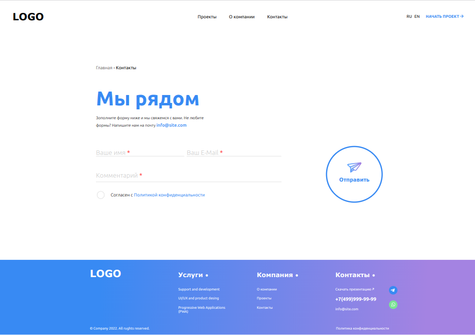
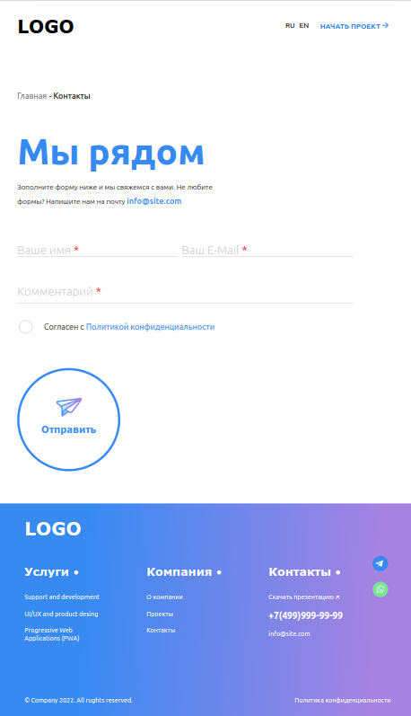
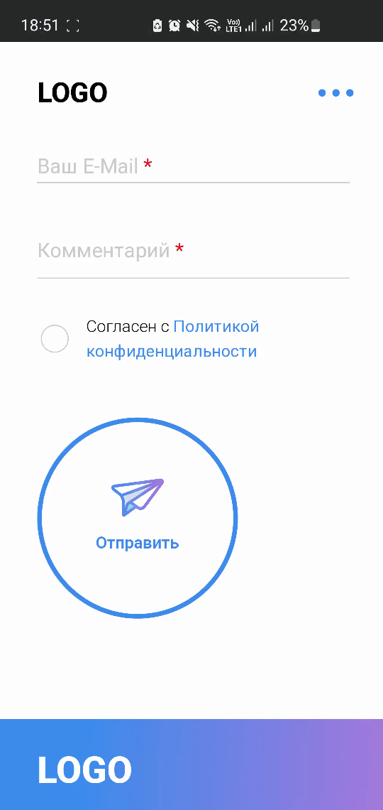

## Тестовое задание

Выполнить адаптивную верстку по макету.
Внимательно отнестись к анимации кнопки. Важно учитывать, что анимация должна быть плавной и приятной для пользователя.

Чтобы запустить проект введите команду в терминале `npm start`   .

Либо перейдите по [ссылке](https://testanimationbtn.herokuapp.com) и проверьте сразу.

